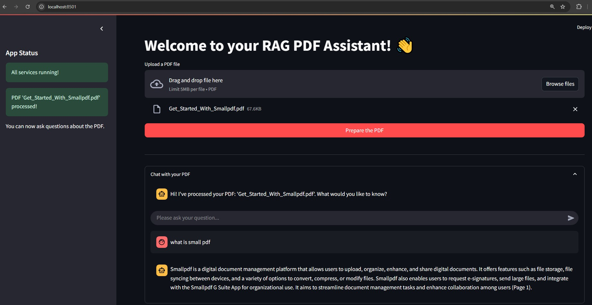

# 📄 rag-pdf-assistant

Turn your static PDFs into conversational agents using RAG. Built with OpenAI, Langchain and Streamlit.


---

## ✨ Features

- 📤 Upload an PDF file
- ⚙️ Process and embed the content using OpenAI
- 💬 Ask questions in a chat interface and get accurate, contextual answers
- 🧠 Uses Retrieval-Augmented Generation (RAG) with OpenAI’s LLMs
- 🌐 Web-based interface using Streamlit

---

## 🚀 Getting Started

### 1. Clone the repo

```bash
git clone https://github.com/ashvinjaiswal/rag-pdf-assistant.git
cd rag-pdf-assistant
```

### 2. Install dependencies and Docker Cotainer for DB

```bash
pip install -r requirements.txt
```

> **Dependencies:**
>
> - `streamlit`
> - `python-dotenv`
> - `openai`
> - `langchain_community`
> - `pypdf`
> - `langchain-openai`
> - `langchain-qdrant`

```bash
docker compose up -d
```

DB Dashboard
http://localhost:6333/dashboard

### 3. Set your OpenAI API key

Create a `.env` file in the root folder:

```env
OPENAI_API_KEY=your-openai-key
```

### 4. Run the app

```bash
streamlit run app.py
```

### 5. Screenshot



---

## 🛠️ How It Works

1. **Upload PDF**
   PDF is parsed using `PyPDF` and text is split into chunks.

2. **Embedding with FAISS**
   Text chunks are embedded using OpenAI embeddings and stored in a qdurant vector store.

3. **RAG Q\&A**
   When you ask a question, relevant chunks are retrieved from qdurant and passed to OpenAI for a final answer.

---

## 📂 File Structure

```
pdf-chat-rag/
│
├── app.py              # Main Streamlit application
├── .env                # API key file
├── requirements.txt    # Python dependencies
└── README.md           # Project description
```

---

## 📄 Example Use Cases

- Academic paper summarization
- Conversational PDF reader
- Personal document assistant

---
